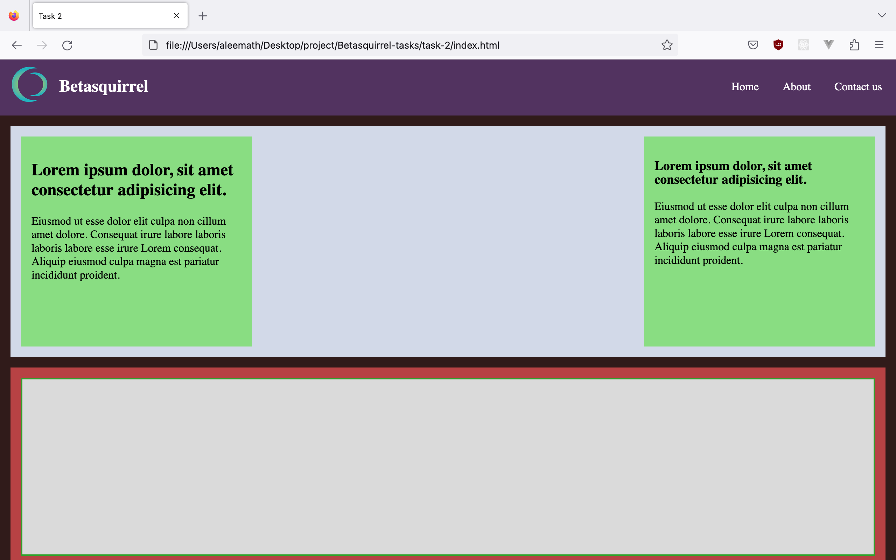

# Betasquirrel-tasks
task from betasquirrel 

## Requirements

| Requirements                | output                          |
|---------------              | ------------------------------- |
|||
|||
|||
## Linux commands

- `cd` - change current directory
- `cd .` - one step back from the current directory
-  `cd ..` - two step back
-  `ls` - list contents of a directory
-  `ls -a` - show hidden files
-  `pwd` - display current working directory
-  `cat` - display contents of a file
-  `clear` - to clear the page
-  `mkdir` - to create a folder

## Git commands

1. `git config` - configure git user Ex: 'git config --global user.name"enter the user name"'
2. `git clone` - clone a remote git repository to your local Ex:'git clone "paste the link"
3. `git add` - add your file changes to git (git add .)
4. `git status` - see the current status
5. `git commit` - commit the changes to git (git commit -m "enter the message")
6. `git push` - push local commit to repo

## Task 3

- [HTML](https://www.w3schools.com/html/default.asp)
- [Attributes](https://www.w3schools.com/html/html_attributes.asp)